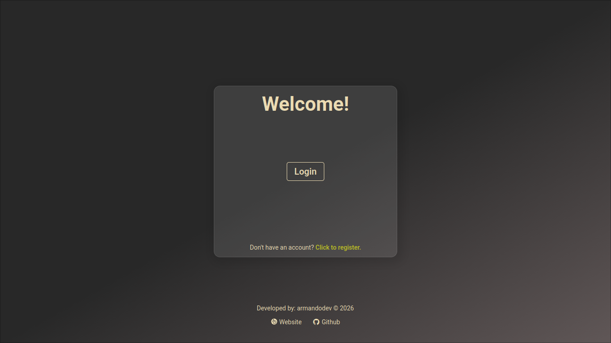
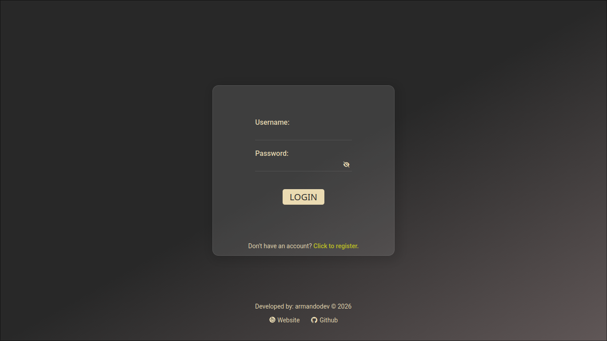
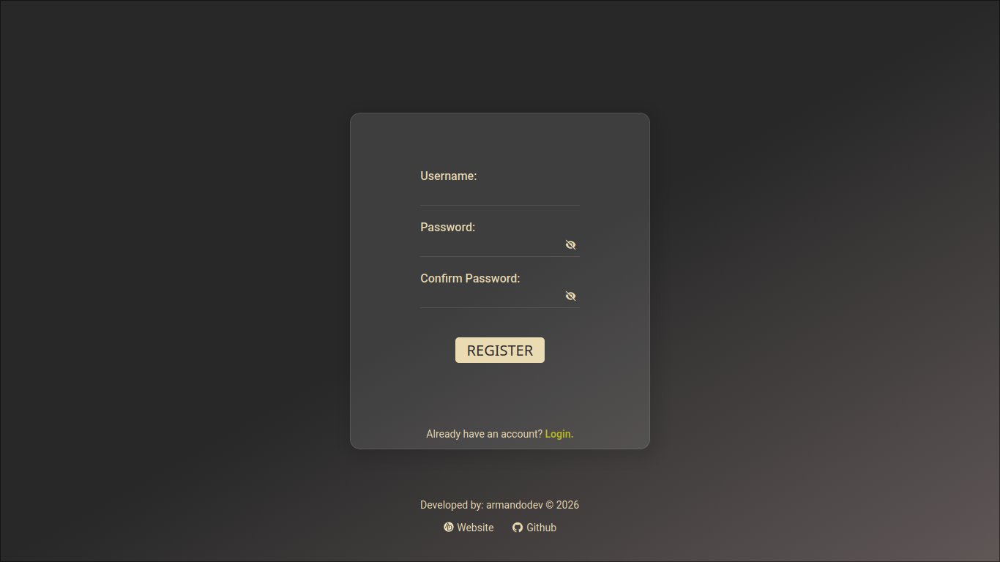
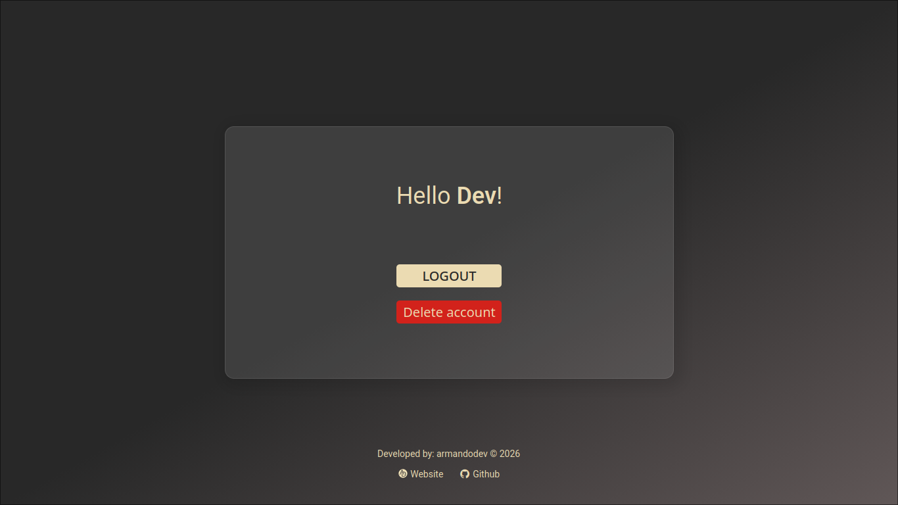
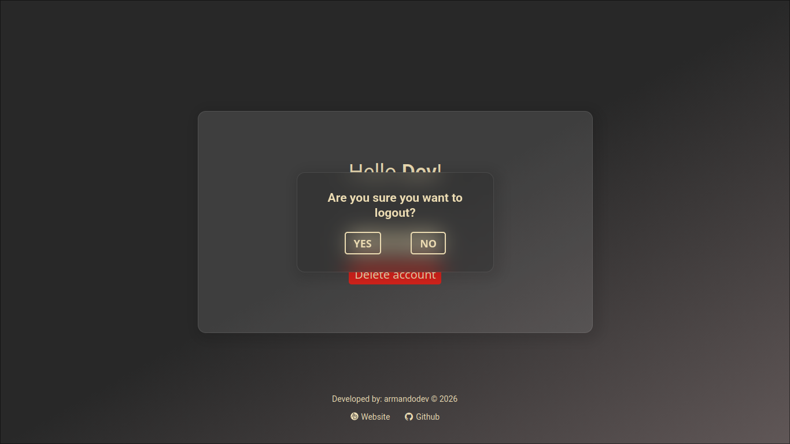
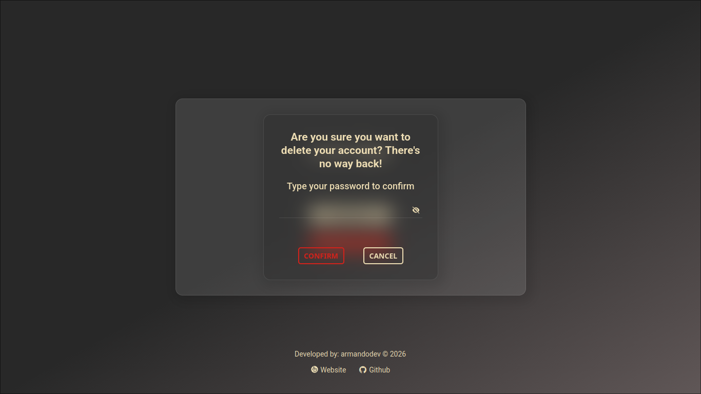

# Login Page

A full-stack application built for learning and portfolio purposes, using React/TypeScript on the frontend and Java Spring Boot on the backend.

The application uses JSON Web Tokens (JWT) for secure authentication and includes user registration, login, protected routes, and account deletion.

## Architecture

```text
React + TypeScript
        │
      Axios
        │
Spring Boot REST API
        │
    PostgreSQL
```

## Authentication

```text
User
 │
Login
 │
Spring Security
 │
JWT
 │
Protected Routes

```

## Preview

[](https://login-page-olive-five.vercel.app)

[Live Demo](https://login-page-olive-five.vercel.app)

## Features

- User registration
- Login with JWT authentication
- Authenticated dashboard
- Account deletion with password confirmation
- Form validation
- Protected routes
- Exception handlers

## Tech Stack

### Frontend

- TypeScript
- React 19
- Vite
- React Router DOM
- TanStack Query
- Axios
- CSS3
- CSS Modules

### Backend

- Java
- Spring Boot
- Spring Security
- JSON Web Tokens (JWT)

### Database

- PostgreSQL

## Local Setup

### Clone the repository

```bash
git clone https://github.com/armandosilvadev/login-page.git

cd login-page
```

### Backend Setup

Navigate to the backend directory:

```bash
cd login-page-backend
```

Set up the environment variables or edit the _application.properties_ file directly, for example:

```properties
api.security.token.secret=YOUR_SECRET_KEY
spring.datasource.url=YOUR_DATABASE_URL
spring.datasource.username=YOUR_DATABASE_USERNAME
spring.datasource.password=YOUR_DATABASE_PASSWORD
```

If you are using IntelliJ, simply run the application. If not, run:

```bash
./mvnw spring-boot:run
```

The server will start at:

```
http://localhost:8080
```

**Don't forget to create the _users_ table in your PostgreSQL database before running the application**

### Frontend Setup

Go to the frontend directory:

```bash
cd login-page-frontend
```

Install the dependencies:

```bash
npm install
```

Create an _.env_ file with:

```env
VITE_API_URL=http://localhost:8080
```

Then run:

```bash
npm run dev
```

The frontend will be available at:

```
http://localhost:5173
```

## Pages

### Login



### Register



### Dashboard





## Why this project

The project was created to practice concepts such as:

- JSON Web Tokens (JWT) authentication
- Security using Spring Security
- Consuming REST APIs
- Integration of React + Spring Boot
- Server state management with React Query
- Improved security and user experience through protected routes
- Full-stack organization

## Future Improvements

- Refresh Tokens
- Email verification
- Password recovery

## License

This project was created for learning and portfolio purposes.
